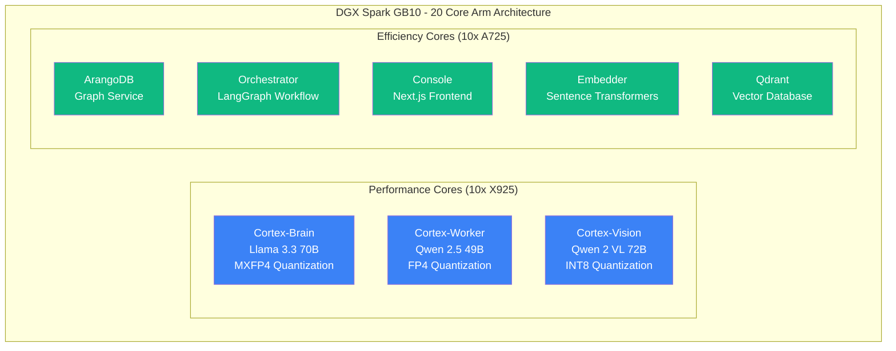
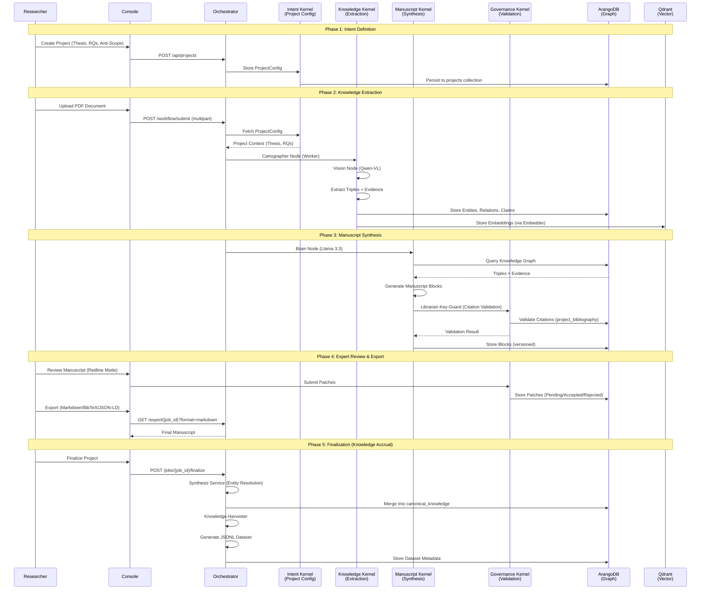

# Project Vyasa: The AI Research Factory

**Project Vyasa** is a high-performance AI research factory designed to run on NVIDIA DGX Spark (Grace Blackwell GB10). It provides a complete pipeline for extracting structured knowledge from research documents, building knowledge graphs, and synthesizing manuscripts—all running locally with zero cloud dependencies.

## Overview

Project Vyasa implements the **Fusion Architecture**, a modular system organized around **Four Kernels** (Intent, Knowledge, Manuscript, Governance) where each service has a specific, well-defined role:

- **Console** (Port 3000): The UI/Cockpit - Next.js frontend for document upload, visualization, and interaction
- **Brain** (Port 30000): High-level reasoning - SGLang + Llama 3.3 70B for routing and validation
- **Worker** (Port 30001): Structured extraction - SGLang + Qwen 2.5 49B for JSON extraction and tagging
- **Vision** (Port 30002): Image analysis - SGLang + Qwen 2 VL 72B for figure/table interpretation
- **Drafter** (Port 11435): The Writer - Ollama for prose generation and summarization
- **Graph** (Port 8529): The Knowledge Graph - ArangoDB for storing entities and relationships
- **Vector** (Port 6333): The Search Index - Qdrant for storing embeddings and enabling semantic search
- **Embedder** (Port 80): The Vectorizer - Sentence Transformers for converting text to vectors
- **Orchestrator** (Port 8000): The Coordinator - Python/LangGraph for workflow orchestration

## Quick Reference: Service Ports

| Service | Port | Container Name | Description |
|---------|------|----------------|-------------|
| **Console** | 3000 | `vyasa-console` | Next.js frontend UI |
| **Brain** | 30000 | `cortex-brain` | SGLang + Llama 3.3 (reasoning) |
| **Worker** | 30001 | `cortex-worker` | SGLang + Qwen 2.5 (extraction) |
| **Vision** | 30002 | `cortex-vision` | SGLang + Qwen 2 VL (image analysis) |
| **Drafter** | 11435 | `drafter` | Ollama (prose generation) |
| **Graph** | 8529 | `vyasa-graph` | ArangoDB (knowledge graph) |
| **Vector** | 6333 | `vyasa-qdrant` | Qdrant (vector database) |
| **Embedder** | 80 | `vyasa-embedder` | Sentence Transformers (embeddings) |
| **Orchestrator** | 8000 | `vyasa-orchestrator` | Python/LangGraph (workflow) |

---

## Hardware Optimization: NVIDIA DGX Spark (Grace Blackwell)

Project Vyasa is optimized for the **NVIDIA DGX Spark (GB10)** superchip, leveraging its unique architecture for maximum performance.

### CPU Core Allocation (20-Core Arm Split)

The DGX Spark features a heterogeneous CPU architecture with 20 Arm cores split into Performance and Efficiency cores:



**Performance Cores (10x X925) - `cpuset: "10-19"`:**
- **Cortex-Brain**: Llama 3.3 70B with MXFP4 quantization (reasoning, validation)
- **Cortex-Worker**: Qwen 2.5 49B with FP4 quantization (extraction, tagging)
- **Cortex-Vision**: Qwen 2 VL 72B with INT8 quantization (image analysis)

**Efficiency Cores (10x A725) - `cpuset: "0-9"`:**
- **ArangoDB**: Knowledge graph storage and queries
- **Orchestrator**: LangGraph workflow coordination
- **Console**: Next.js frontend server
- **Embedder**: Sentence Transformers inference
- **Qdrant**: Vector database operations

### Unified Memory Model (128GB LPDDR5x)

The DGX Spark features **128GB of unified LPDDR5x coherent memory**, shared between CPU and GPU. This enables:

1. **Single Memory Pool**: All services (CPU and GPU) access the same memory space without explicit transfers
2. **Mixed Precision Optimization**: MXFP4/FP4 quantization allows the 120B/49B model committee to fit within the 128GB pool:
   - **Llama 3.3 70B** (MXFP4): ~35GB weights + KV cache
   - **Qwen 2.5 49B** (FP4): ~25GB weights + KV cache (4 concurrent requests, 16K context)
   - **Qwen 2 VL 72B** (INT8): ~36GB weights + KV cache
   - **Remaining**: ~32GB for ArangoDB, Qdrant, and system overhead

3. **Zero-Copy Data Sharing**: Evidence pointers, triples, and manuscript blocks can be passed between services without serialization overhead

### Quantization Strategy

| Model | Quantization | Memory Savings | Use Case |
|-------|-------------|----------------|----------|
| **Llama 3.3 70B** | MXFP4 | ~4x | Reasoning, validation (preserves logic) |
| **Qwen 2.5 49B** | FP4 | ~4x | Extraction, tagging (high throughput) |
| **Qwen 2 VL 72B** | INT8 | ~2x | Vision, figure analysis (balanced precision) |

**Memory Fraction Static**: 
- **Cortex-Brain** and **Cortex-Worker**: `--mem-fraction-static 0.70` (70% for weights, 30% for KV cache)
- **Cortex-Vision**: `--mem-fraction-static 0.75` (75% for weights, 25% for KV cache)
- **Headroom Guarantee**: At least 24GB of unified memory remains unallocated for OS, ArangoDB buffers, and Qdrant operations

---

## The Research Factory Workflow: Four-Kernel Architecture

Project Vyasa operates as a **Four-Kernel research factory**, where each kernel has a specific responsibility in the research pipeline.

### Visual Flow: Research Factory Workflow



### Kernel Responsibilities

#### 1. Intent Kernel (Project Config)
- **Responsibility**: Scope & direction
- **Key Object**: `ProjectConfig` (Thesis, RQs, Anti-Scope, Seed Corpus, Target Journal)
- **Invariant**: No agent runs without a `project_id`. Project context is injected into every prompt/tool call.
- **Storage**: ArangoDB `projects` collection

#### 2. Knowledge Kernel (Evidence Extraction)
- **Responsibility**: Ingestion & alignment
- **Key Object**: `Claim` (claim_text, confidence, evidence_spans, source pointers)
- **Logic**:
  - Extract broadly (high recall)
  - **Tag** priority (`HIGH`/`LOW`) based on Project RQs
  - Do NOT hard-filter at ingestion; tag and rank instead
- **Services**: Worker (Qwen 2.5), Vision (Qwen 2 VL)
- **Storage**: ArangoDB `entities`, `relations`, `claims` collections

#### 3. Manuscript Kernel (Production)
- **Responsibility**: Assembly, edits, versioning
- **Key Objects**: `Block` (Paragraph/Figure/Table/Equation) and `Patch` (Edit Operation)
- **Invariant**: Every text block must bind to specific `Claim_IDs` and `Citation_Keys`
- **Editing Model**: Agents propose patches (block-level replace/insert/delete). Humans accept/reject (redline review)
- **Services**: Brain (Llama 3.3) for synthesis
- **Storage**: ArangoDB `manuscript_blocks`, `patches` collections

#### 4. Governance Kernel (Quality)
- **Responsibility**: Safety & validation gates
- **Key Objects**: `Guard` (Drift, Citation, Evidence, Contract)
- **Logic**: Roles (prompts) are versioned configuration in the DB, not hardcoded strings in code
- **Guards**:
  - **Librarian Key-Guard**: Validates citation keys against `project_bibliography` collection
  - **Evidence Guard**: Ensures all claims have `source_pointer` (page/bbox/snippet)
  - **Schema Guard**: Validates JSON structure via Pydantic models

---

## Evidence & Provenance: Code-to-Research Requirements

Project Vyasa enforces strict **evidence binding** and **provenance tracking** to ensure research integrity. Every claim must be traceable back to its source.

### 1. SHA256 Provenance

**Requirement**: Every PDF document is hashed using SHA256 for identity verification.

**Implementation**:
- PDFs are hashed during ingestion in `src/orchestrator/server.py`
- Hash is stored in `SourcePointer.doc_hash` field
- Used for deduplication and evidence binding

**Code Reference**: `src/shared/schema.py` → `SourcePointer.doc_hash`

### 2. Evidence Binding (Source Pointers) - **REQUIRED**

**Requirement**: Every claim/triple **MUST** contain a `source_pointer` (no longer optional) with:
- `doc_hash`: SHA256 hash of source document (**required**)
- `page`: 1-based page number (**required**)
- `bbox`: Normalized bounding box `[x1, y1, x2, y2]` (0-1000 scale, **required**, must be exactly 4 elements)
- `snippet`: Exact text excerpt from the source (**required**)

**Real Text Verification**:
- PDF text layers are cached by `doc_hash` and `page` number in ArangoDB (`pdf_text_cache` collection)
- Critic node performs fuzzy string matching between extracted snippet and actual page text
- Claims/triples failing verification are rejected with clear error messages
- Bbox coordinates are validated to ensure they fall within [0, 1000] range

**PDF Text Cache Service**:
- **Implementation**: `src/orchestrator/pdf_text_cache.py`
- **Storage**: ArangoDB `pdf_text_cache` collection (keyed by `doc_hash` and `page`)
- **Fallback**: Extracts from PDF file if cache miss (requires `pdf_path` in state)

**Implementation**:
```python
class SourcePointer(BaseModel):
    doc_hash: str  # SHA256 hash
    page: int  # 1-based page number
    bbox: List[float]  # [x1, y1, x2, y2] normalized to 0-1000
    snippet: str  # Exact text excerpt
```

**Code Reference**: `src/shared/schema.py` → `SourcePointer`, `Claim.source_pointer`

### 3. Librarian Key-Guard (Citation Validation)

**Requirement**: No manuscript block can be saved with unverified citation keys.

**Implementation**:
- Before saving a `ManuscriptBlock`, the system validates all `citation_keys` against the `project_bibliography` collection
- Raises `ValueError` if any citation key is missing
- Prevents AI from generating blocks with invalid citations

**Code Reference**: `src/manuscript/service.py` → `_validate_citations()`, `save_block(validate_citations=True)`

**Validation Flow**:
1. Manuscript block contains `citation_keys: ["smith2023", "jones2024"]`
2. System queries `project_bibliography` collection for `project_id`
3. If any key is missing → **Block save fails** with clear error message
4. Researcher must add missing citations to bibliography first

### 4. Version History & Audit Trail

**Requirement**: Every manuscript block update creates a new version for full auditability.

**Implementation**:
- Document keys: `{project_id}_{block_id}_v{version}`
- Version numbers auto-increment on each save
- Full history queryable via `ManuscriptService.get_block(project_id, block_id, version=None)` (returns latest) or specific version

**Code Reference**: `src/manuscript/service.py` → `_get_next_version()`, `save_block()`

---

## Knowledge Accrual: Global Repository

Project Vyasa maintains a **Global Repository** (`canonical_knowledge` collection) that accumulates expert-vetted knowledge across all projects. This enables entity resolution, conflict management, and evidence-aware retrieval-augmented generation (RAG).

### Architecture

The Global Repository operates as a persistent knowledge base that grows with each finalized project:

1. **Entity Resolution**: Brain (120B) matches new verified claims against existing canonical entities using semantic similarity
2. **Conflict Management**: Contradictions are flagged for "Systemic Review" rather than being overwritten
3. **Provenance Tracking**: Every canonical entry maintains a `provenance_log` tracking all contributing projects and jobs
4. **Evidence-Aware RAG**: Cartographer queries established knowledge before extraction to guide focus

### Finalization Workflow

When a project is finalized (`POST /jobs/<job_id>/finalize`):

1. **Synthesis Phase**:
   - All `is_expert_verified: true` claims are collected from the project
   - Brain (120B) performs entity resolution against `canonical_knowledge`
   - Matching entities are merged (attributes and `source_pointers` aggregated)
   - Contradictions are flagged with `conflict_flags` for manual review
   - New entities are added to canonical knowledge with full provenance

2. **Harvesting Phase**:
   - Expert-verified `ManuscriptBlock`s are harvested into "manuscript_synthesis" instruction pairs
   - Expert-verified `GraphTriple`s are harvested into "evidence_extraction" instruction pairs
   - JSONL datasets are written to `/raid/datasets/fine_tuning_v1.jsonl` (configurable via `VYASA_DATASET_DIR`)

**Code References**:
- `src/orchestrator/synthesis_service.py` → `SynthesisService.finalize_project()`
- `src/orchestrator/harvester_node.py` → `KnowledgeHarvester.harvest_project()`
- `src/shared/schema.py` → `CanonicalKnowledge`, `ProvenanceEntry`

### Evidence-Aware RAG

Before extraction, the Cartographer node performs a **Pre-Extraction Lookup**:

1. Extracts potential entity names and keywords from raw text
2. Queries `canonical_knowledge` for matching entities (by `entity_name`, `entity_type`, or keyword match)
3. Injects "ESTABLISHED KNOWLEDGE" section into the system prompt
4. Guides extraction to focus on new relationships or updated information rather than re-extracting known facts

This reduces redundancy and improves extraction quality by leveraging accumulated knowledge.

**Code Reference**: `src/orchestrator/nodes.py` → `cartographer_node()`, `_query_established_knowledge()`

---

## Knowledge Harvester: Automatic Dataset Generation

Project Vyasa automatically generates JSONL instruction datasets from expert-verified research for fine-tuning models on the DGX Spark. This enables continuous improvement of extraction and synthesis capabilities.

### Dataset Types

1. **Manuscript Synthesis Pairs**:
   - **Input**: Graph Triples (JSON) linked to a `ManuscriptBlock`
   - **Output**: Finalized Markdown text from the block
   - **Metadata**: `project_id`, `block_id`, `claim_ids`, `citation_keys`, `timestamp`
   - **Type**: `"manuscript_synthesis"`

2. **Evidence Extraction Pairs**:
   - **Input**: Text snippet from `source_pointer.snippet`
   - **Output**: Structured triple (JSON) with `subject`, `predicate`, `object`
   - **Metadata**: `project_id`, `doc_hash`, `page`, `bbox`, `timestamp`
   - **Type**: `"evidence_extraction"`

### Storage & Format

- **Location**: `/raid/datasets/fine_tuning_v1.jsonl` (configurable via `VYASA_DATASET_DIR` environment variable)
- **Fallback**: `/tmp/vyasa_datasets/fine_tuning_v1.jsonl` if `/raid` is unavailable
- **Format**: JSONL (one JSON object per line)
- **Structure**:
  ```json
  {
    "instruction": "Extract knowledge graph from the following text snippet...",
    "input": "The vulnerability in PLC systems...",
    "output": "{\"triples\": [{\"subject\": \"PLC\", \"predicate\": \"has_vulnerability\", \"object\": \"CVE-2024-1234\"}]}",
    "metadata": {
      "project_id": "550e8400-e29b-41d4-a716-446655440000",
      "job_id": "job-123",
      "timestamp": "2024-01-15T10:30:00Z",
      "type": "evidence_extraction",
      "doc_hash": "abc123...",
      "page": 5,
      "bbox": [100, 200, 300, 250]
    }
  }
  ```

### Triggering

Harvesting is automatically triggered when:
- A job is finalized (`POST /jobs/<job_id>/finalize`)
- Expert-verified blocks/triples exist (`is_expert_verified: true`)
- Project has `project_id` present

**Code Reference**: `src/orchestrator/harvester_node.py` → `KnowledgeHarvester.harvest_project()`

### Curated Training

Dataset metadata includes `project_id` and `timestamp`, enabling:
- Filtering by project quality or domain
- Temporal analysis of extraction improvements
- Selective fine-tuning on high-confidence projects

---

## Setup & Reproduction

Project Vyasa includes preflight checks and startup scripts to ensure your DGX Spark environment is properly configured before launching.

### Preflight Check (`scripts/preflight_check.sh`)

**Purpose**: Validates hardware, memory, configuration, and port availability before launching the stack.

**Checks Performed**:
1. **NVIDIA GB10 Superchip Detection**: Verifies `nvidia-smi` can detect Grace Blackwell hardware
2. **Unified Memory Verification**: Ensures at least 120GB of total unified memory (DGX Spark has 128GB)
3. **Expertise Configuration**: Warns if `data/private/expertise.json` is missing (falls back to generic prompts)
4. **Port Availability**: Checks ports 30000 (Brain), 30001 (Worker), and 8529 (ArangoDB) for conflicts

**Usage**:
```bash
chmod +x scripts/preflight_check.sh
./scripts/preflight_check.sh
```

**Expected Output**:
```
==========================================
Project Vyasa - Preflight Check
DGX Spark (GB10) Validation
==========================================

Checking NVIDIA GB10 superchip detection... PASS
  Detected: NVIDIA Grace Blackwell
  GPU Count: 1

Checking unified memory (minimum 120GB required)... PASS
  Total Unified Memory: 128GB

Checking for expertise configuration... WARN
  Warning: data/private/expertise.json not found.
  The system will use generic prompts instead of expert-tuned prompts.

Checking port availability...
  Port 30000 (Brain (Cortex))... AVAILABLE
  Port 30001 (Worker (Cortex))... AVAILABLE
  Port 8529 (Graph (ArangoDB))... AVAILABLE

==========================================
Preflight Check Summary
==========================================
  Passed:  4
  Failed:  0
  Warnings: 1

✓ Launch Ready
```

### Startup Script (`deploy/start.sh`)

**Purpose**: Master ignition script that launches the entire stack and verifies system health.

**Steps**:
1. **Pre-flight Checks**:
   - Verifies `deploy/.env` exists and doesn't contain placeholder values
   - Checks Docker daemon is running
   - Secures `.env` file permissions (chmod 600)

2. **Launch Stack**:
   - Runs `docker compose up -d` with proper environment file
   - Removes orphaned containers

3. **Health Verification**:
   - Waits for ArangoDB (`vyasa-graph`) to become healthy (max 30 attempts, 2s intervals)
   - Seeds role profiles via orchestrator container
   - Polls orchestrator `/health` endpoint (max 30 attempts, 2s intervals)

4. **Output URLs**:
   - Console: `http://localhost:3000`
   - ArangoDB: `http://localhost:8529`

**Usage**:
```bash
cd deploy
chmod +x start.sh
./start.sh
```

**Expected Output**:
```
Starting Project Vyasa stack...
Waiting for vyasa-graph to become healthy.....
ArangoDB is healthy.
Seeding roles via orchestrator...
Waiting for orchestrator to become ready.....
✅ System Online: http://localhost:3000

Console:  http://localhost:3000
ArangoDB: http://localhost:8529
```

### Quick Start

1. **Preflight Check**:
   ```bash
   ./scripts/preflight_check.sh
   ```

2. **Configure Environment**:
   ```bash
   cd deploy
   cp .env.example .env
   # Edit .env with your model paths, GPU IDs, and secrets
   ```

3. **Launch Stack**:
   ```bash
   ./start.sh
   ```

4. **Access Console**:
   - Open `http://localhost:3000` in your browser
   - Create a project with Thesis and Research Questions
   - Upload PDF documents to begin extraction

---

## Documentation Structure

### 📐 [Architecture](./architecture/)
- **[System Map](./architecture/system-map.md)**: Visual diagrams of data flows and system interactions
- **[Agent Orchestration API](./architecture/07-agent-orchestration-api.md)**: LangGraph state machine and API surface
- **[System Context](./architecture/system-context.md)**: High-level architecture overview

### 📋 [Decisions](./decisions/)
- **[001: Qdrant Selection](./decisions/001-qdrant-selection.md)**: Why we chose Qdrant for vector storage
- **[001: Local Vector DB](./decisions/001-local-vector-db.md)**: Decision to replace Pinecone with local Qdrant

### 📖 [Runbooks](./runbooks/)
- **[Operator Handbook](./runbooks/operator-handbook.md)**: Step-by-step operations guide

---

## Key Principles

1. **Functional Naming**: All services use descriptive, functional names (no mythological metaphors)
2. **Strict JSON**: Cortex uses SGLang regex constraints for guaranteed structured output
3. **Graph-First**: State is written to ArangoDB immediately, not stored in variables
4. **Local-Only**: Zero external API dependencies—everything runs within the Docker network
5. **Type Safety**: Pydantic models ensure data consistency across services
6. **Evidence Binding**: Every claim must have a `source_pointer` with page/bbox/snippet
7. **Citation Validation**: Librarian Key-Guard prevents invalid citations in manuscript blocks
8. **Version History**: Every block update creates a new version for full auditability

---

## Technology Stack

- **Frontend**: Next.js 15, React 19, TypeScript
- **Backend**: Python 3.11, SGLang, LangGraph
- **Databases**: ArangoDB (graph), Qdrant (vector)
- **ML Models**: 
  - Llama 3.3 70B (Brain) - MXFP4 quantization
  - Qwen 2.5 49B (Worker) - FP4 quantization
  - Qwen 2 VL 72B (Vision) - INT8 quantization
  - Sentence Transformers (Embedder)
- **Infrastructure**: Docker Compose, NVIDIA GPU runtime, DGX Spark (GB10)

---

## Contributing

See the [Operator Handbook](./runbooks/operator-handbook.md) for setup instructions.

For questions or issues, please refer to the architecture documentation or open an issue in the repository.
