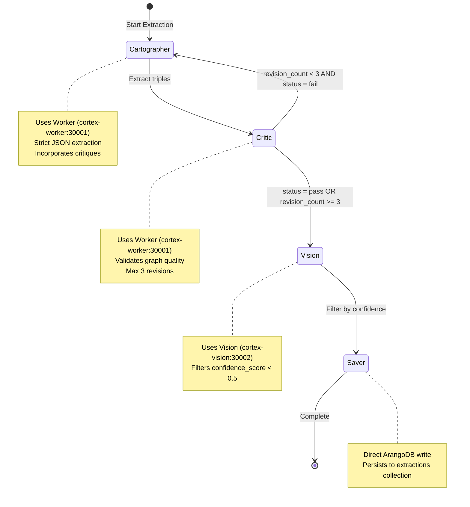
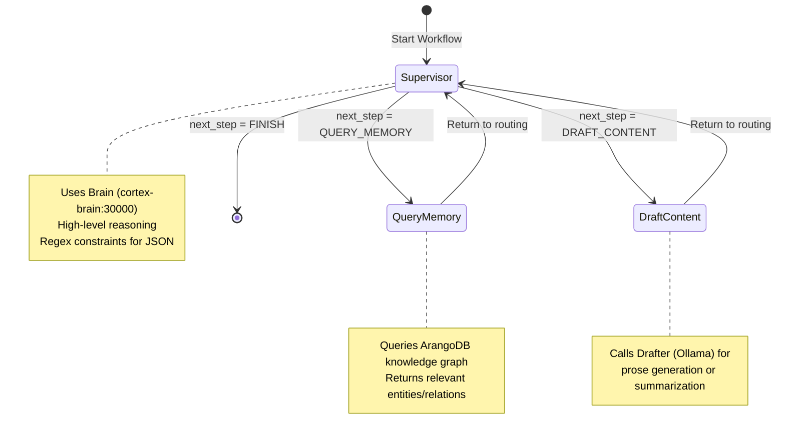
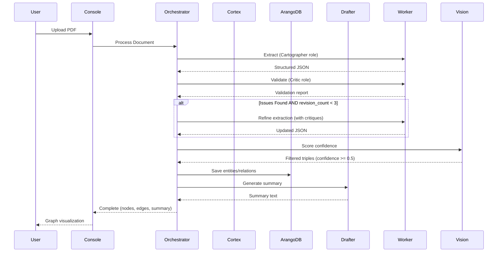
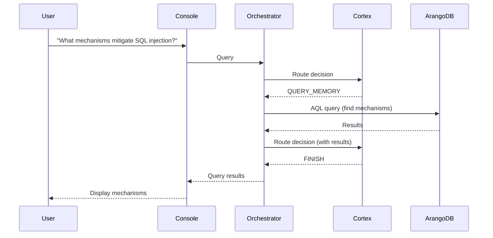

# Agent Workflow: LangGraph State Machine

> **The Brain** - How Project Vyasa orchestrates research automation using LangGraph.

## Overview

The Orchestrator uses LangGraph to manage a state machine that coordinates extraction, validation, and synthesis workflows. The state machine is driven by a **Supervisor** node that makes routing decisions using SGLang (Cortex).

## State Definition

```python
class SupervisorState(TypedDict):
    """State managed by the LangGraph supervisor."""
    messages: Annotated[List[Dict[str, Any]], "List of messages in the conversation"]
    next_step: NextStep  # QUERY_MEMORY | DRAFT_CONTENT | FINISH
    query_result: Optional[Dict[str, Any]]  # Results from ArangoDB query
    draft_content: Optional[str]  # Generated prose from Drafter
    plan: Optional[Dict[str, Any]]  # Execution plan
    error: Optional[str]  # Error message if workflow fails
```

## State Machine Diagram

### Document Processing Workflow (Cartographer → Critic Loop)



### Supervisor Workflow (Query/Draft Routing)



## Workflow Nodes

### 1. Cartographer (Extraction Node)

**Purpose**: Extract structured knowledge graph from text using Worker service.

**Implementation**:
- Uses **Worker** (`cortex-worker:30001`) for strict JSON extraction
- Incorporates prior critiques for iterative refinement
- Normalizes output to guarantee `{"triples": [...]}` structure
- Model: Cheap model (e.g., `meta-llama/Llama-3.1-8B-Instruct`)

**Output**: `PaperState` with `extracted_json` containing triples array

**Role**: "The Cartographer" (stored in ArangoDB `roles` collection)

### 2. Critic (Validation Node)

**Purpose**: Validate extracted graph and return pass/fail with critiques.

**Implementation**:
- Uses **Worker** (`cortex-worker:30001`) for validation (cheap model)
- Checks for completeness, missing evidence, hallucinations
- Increments `revision_count` on failure
- Max 3 revisions before manual review

**Output**: `PaperState` with `critic_status` ("pass" or "fail") and `critiques` list

**Role**: "The Critic" (stored in ArangoDB `roles` collection)

### 3. Vision (Confidence Filtering Node)

**Purpose**: Filter extracted triples by confidence score.

**Implementation**:
- Uses **Vision** (`cortex-vision:30002`) for confidence scoring
- Filters out triples where `confidence_score < 0.5`
- Preserves high-confidence extractions only

**Output**: `PaperState` with filtered `extracted_json`

**Role**: "Vision" (Eye service)

### 4. Saver (Persistence Node)

**Purpose**: Persist extracted graph to ArangoDB.

**Implementation**:
- Direct ArangoDB connection (`memory:8529`)
- Saves to `extractions` collection
- Includes critiques and status flag

**Output**: `PaperState` (unchanged, side effect: database write)

### 5. Supervisor (Entry Point - Optional)

**Purpose**: Route to the next step based on conversation history and current state.

**Implementation**:
- Uses **Brain** (`cortex-brain:30000`) with dynamic role prompt from `RoleRegistry`
- Constrained decoding via regex to ensure valid JSON output
- Outputs: `{"next_step": "QUERY_MEMORY|DRAFT_CONTENT|FINISH", "reasoning": "..."}`

**Role**: "Supervisor" (stored in ArangoDB `roles` collection)

**Note**: Currently used in Supervisor workflow, not in Cartographer→Critic loop

**Example Prompt**:
```
You are the Supervisor for Project Vyasa, a research factory.
Your task is to decide the next step in the workflow based on the conversation history.

Available steps:
- QUERY_MEMORY: Query the knowledge graph (ArangoDB) for relevant information
- DRAFT_CONTENT: Generate draft content using the Worker (Ollama)
- FINISH: Complete the task and return results

Analyze the conversation and determine the next step.
```

### 2. Query Memory

**Purpose**: Retrieve relevant information from the ArangoDB knowledge graph.

**Implementation**:
- Executes AQL queries against ArangoDB
- Searches for entities, relations, or documents matching the query
- Returns structured results (nodes, edges, metadata)

**Query Types**:
- Entity lookup by name/type
- Relation traversal (e.g., find all mechanisms that mitigate a vulnerability)
- Graph pattern matching (e.g., find all paths between two entities)

### 3. Draft Content

**Purpose**: Generate prose, summaries, or creative content using Drafter (Ollama).

**Implementation**:
- Calls Drafter API (`/api/generate`)
- Uses conversation history and query results as context
- Returns generated text

**Use Cases**:
- Document summarization
- Research report generation
- Explanation of graph relationships

## Role-Based Extraction

The extraction workflow uses **dynamic roles** stored in ArangoDB:

### The Cartographer (Extractor)

**Purpose**: Extract structured entities and relations from text.

**State Flow**:
```
Text Input → Cartographer Role → Worker (cortex-worker:30001) → Structured JSON → Normalize → State
```

**Service**: Worker (`get_worker_url()`) - Cheap model for high-volume extraction

**Output Schema** (normalized to guarantee structure):
```json
{
  "triples": [
    {
      "subject": "entity or concept name",
      "predicate": "relationship type",
      "object": "target entity",
      "confidence": 0.0-1.0,
      "evidence": "text excerpt (optional)"
    }
  ],
  "entities": [...],  # Optional
  "claims": [...],    # Optional
  "metadata": {...}   # Optional
}
```

### The Critic (Validator)

**Purpose**: Validate extracted graphs and identify logic gaps.

**State Flow**:
```
Graph Data → Critic Role → Worker (cortex-worker:30001) → Validation Report → State Update
```

**Service**: Worker (`get_worker_url()`) - Cheap model for validation

**Output Schema**:
```json
{
  "status": "pass" | "fail",
  "critiques": [
    "Issue description 1",
    "Issue description 2"
  ]
}
```

**State Updates**:
- `critic_status`: "pass" or "fail"
- `critiques`: List of critique strings
- `revision_count`: Incremented on failure (max 3)

### The Vision (Confidence Filter)

**Purpose**: Filter triples by confidence score.

**State Flow**:
```
Extracted JSON → Vision (cortex-vision:30002) → Confidence Scoring → Filter (>= 0.5) → State
```

**Service**: Vision (`get_vision_url()`) - Large model for confidence scoring

**Output**: Filtered `extracted_json` with only high-confidence triples

## Complete Workflow Example

### Document Processing



### Research Query



## Error Handling

The state machine includes error handling at each node:

1. **Supervisor Errors**: Falls back to default routing logic
2. **Query Errors**: Returns empty results, logs error
3. **Draft Errors**: Returns error message, continues workflow
4. **State Validation**: TypedDict ensures type safety

## State Persistence

Currently, state is **ephemeral** (in-memory). For production:

- Consider persisting state to ArangoDB for long-running workflows
- Use checkpoints for recovery after failures
- Implement state versioning for audit trails

## Extending the Workflow

To add new nodes:

1. **Define Node Function**:
   ```python
   def my_node(state: SupervisorState) -> SupervisorState:
       # Process state
       return updated_state
   ```

2. **Add to Graph**:
   ```python
   workflow.add_node("my_node", my_node)
   ```

3. **Add Routing Logic**:
   ```python
   workflow.add_conditional_edges(
       "supervisor",
       should_route_to_my_node,
       {"my_node": "my_node", ...}
   )
   ```

4. **Update NextStep Enum**:
   ```python
   class NextStep(str, Enum):
       MY_NODE = "MY_NODE"
       # ... existing steps
   ```

## Performance Considerations

- **Cortex Calls**: Batch multiple extractions when possible
- **ArangoDB Queries**: Use indexes, limit result sets
- **State Size**: Keep messages list bounded (e.g., last 10 messages)
- **Parallel Execution**: Consider parallel node execution for independent operations

