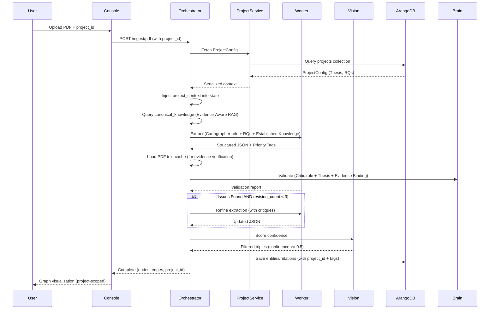

# Agent Workflow: LangGraph State Machine

> **The Brain** - How Project Vyasa orchestrates research automation using LangGraph with Project-First architecture.

## Overview

The Orchestrator uses LangGraph to manage a state machine that coordinates extraction, validation, and synthesis workflows. The state machine is **Project-First**: all workflows require a `project_id`, and project context (Thesis, RQs) is injected early in the pipeline to guide extraction and tagging.

## State Definition

```python
class PaperState(TypedDict):
    """State managed by the LangGraph workflow."""
    raw_text: str
    pdf_path: str
    image_paths: List[str]
    vision_results: List[Dict[str, Any]]
    extracted_json: Dict[str, Any]  # Guaranteed to have "triples" array
    critiques: List[str]
    revision_count: int
    project_id: Optional[str]  # UUID of the project
    project_context: Optional[Dict[str, Any]]  # Serialized ProjectConfig (Thesis, RQs, Anti-Scope)
```

## State Machine Diagram

### Document Processing Workflow (Project-First: Cartographer → Critic → Vision → Saver)

```mermaid
stateDiagram-v2
    [*] --> ContextInjection: Start with project_id
    ContextInjection --> Cartographer: Hydrate project context
    Cartographer --> Critic: Extract + Tag (HIGH/LOW)
    Critic --> Cartographer: revision_count < 3 AND status = fail
    Critic --> Vision: status = pass OR revision_count >= 3
    Vision --> Saver: Filter by confidence
    Saver --> [*]: Complete (save to Graph)
    
    note right of ContextInjection
        Middleware fetches ProjectConfig
        Serializes Thesis/RQs into state
    end note
    
    note right of Cartographer
        Uses Worker (cortex-worker:30001)
        Evidence-Aware RAG: Queries canonical_knowledge
        Injects Established Knowledge into prompt
        Strict JSON extraction
        Tags claims HIGH/LOW based on RQs
        Incorporates critiques
    end note
    
    note right of Critic
        Uses Brain (cortex-brain:30000)
        Hardened Evidence Binding:
        - Requires doc_hash (hard requirement)
        - Validates bbox [0-1000]
        - Real text verification (fuzzy match)
        Validates graph quality
        Checks against Thesis
        Max 3 revisions
    end note
    
    note right of Vision
        Uses Vision (cortex-vision:30002)
        Filters confidence_score < 0.5
    end note
    
    note right of Saver
        Direct ArangoDB write
        Persists with project_id
        Saves claims with priority tags
        Builds ArtifactManifest (blocks/tables/visuals/totals)
        Persists manifest to ArangoDB + /raid/artifacts (best-effort)
    end note

## Observability & Evaluation
- Telemetry JSONL remains the primary source of operational truth.
- Optional Opik tracing emits advisory per-node spans (metadata only: model, tokens, duration, flags).
- Opik is non-blocking and does not influence routing, acceptance, or job status.
```

## Workflow Nodes

### 0. Context Injection (Middleware - Early Pattern)

**Purpose**: Fetch `ProjectConfig` from ArangoDB and inject into workflow state before any agent runs.

**Implementation**:
- Executes in API layer (`POST /ingest/pdf`, `POST /workflow/submit`)
- Fetches `ProjectConfig` via `ProjectService.get_project(project_id)`
- Serializes to dict: `project.model_dump()`
- Stores in `PaperState["project_context"]`
- If project not found or DB unavailable: logs warning, continues without context (non-fatal)

**Output**: `PaperState` with `project_id` and `project_context` populated

### 1. Cartographer (Extraction Node)

**Purpose**: Extract structured knowledge graph from text using Worker service, with project-aware tagging and evidence-aware RAG.

**Implementation**:
- Uses **Worker** (`cortex-worker:30001`) for strict JSON extraction
- **Hydrates project context** if missing (fallback pattern)
- **Evidence-Aware RAG**: Performs pre-extraction lookup in `canonical_knowledge` collection
  - Extracts potential entity names from raw text (keyword-based heuristic)
  - Queries `canonical_knowledge` for matching entities
  - Injects "ESTABLISHED KNOWLEDGE" section into system prompt
  - Guides extraction to focus on new relationships or updated information
- **Tags claims** as `HIGH_PRIORITY` or `LOW_PRIORITY` based on Research Questions
- Incorporates prior critiques for iterative refinement
- Normalizes output to guarantee `{"triples": [...]}` structure
- Model: `Qwen 2.5 49B` (Worker)

**Evidence-Aware RAG Flow**:
1. Extract capitalized words/phrases from raw text (potential entity names)
2. Query `SynthesisService.query_established_knowledge()` with entity names
3. If matches found: inject "ESTABLISHED KNOWLEDGE" section into system prompt
4. Limit to top 10 entries to avoid prompt bloat
5. Guide LLM to focus on new relationships rather than re-extracting known facts

**Tagging Logic**:
- If claim directly addresses Thesis or any RQ → `HIGH_PRIORITY`
- Otherwise → `LOW_PRIORITY`
- Tags are stored in `extracted_json` metadata

**Output**: `PaperState` with `extracted_json` containing triples array and priority tags

**Role**: "The Cartographer" (stored in ArangoDB `roles` collection)

**Code Reference**: `src/orchestrator/nodes.py` → `cartographer_node()`, `_query_established_knowledge()`

### 2. Critic (Validation Node)

**Purpose**: Validate extracted graph with hardened evidence binding checks, ensuring all claims are traceable to source text.

**Implementation**:
- Uses **Brain** (`cortex-brain:30000`) for high-level reasoning and validation
- **Hardened Evidence Binding Validation** (The Critic's Gate):
  - **Requires `doc_hash`**: Every claim/triple must have a `doc_hash` (hard requirement, no exceptions)
  - **Validates `bbox` range**: Must be exactly 4 elements, all values in [0, 1000]
  - **Real Text Verification**: Performs fuzzy string matching between extracted snippet and actual page text
    - Loads page text from PDF cache (`pdf_text_cache` collection) using `doc_hash` and `page`
    - Uses `difflib.SequenceMatcher` with 0.6 similarity threshold
    - Rejects claims/triples where snippet doesn't match page text
  - **Requires `source_pointer`**: All fields (`doc_hash`, `page`, `bbox`, `snippet`) must be present
- Checks for completeness, missing evidence, hallucinations, quantization artifacts
- Validates against Thesis (from `project_context`)
- Detects FP4 quantization failures (garbled text, repetitive tokens)
- Increments `revision_count` on failure
- Max 3 revisions before manual review

**Validation Process**:
1. For each claim and triple in `extracted_json`:
   - Check `doc_hash` exists (hard requirement)
   - Check `source_pointer` has all required fields (`page`, `bbox`, `snippet`)
   - Validate `bbox` is exactly 4 elements, all in [0, 1000] range
   - Load page text from cache using `doc_hash` and `page`
   - Perform fuzzy match between `snippet` and page text (threshold: 0.6)
   - Reject if any check fails
2. Aggregate all validation failures into critiques list
3. If any failures: set `critic_status = "fail"`

**Output**: `PaperState` with `critic_status` ("pass" or "fail") and `critiques` list

**Role**: "The Critic" (stored in ArangoDB `roles` collection)

**Code Reference**: `src/orchestrator/nodes.py` → `critic_node()`, `_validate_claims()`, `_load_page_text()`, `_snippet_exists()`

### 3. Vision (Confidence Filtering Node)

**Purpose**: Filter extracted triples by confidence score.

**Implementation**:
- Uses **Vision** (`cortex-vision:30002`) for confidence scoring
- Filters out triples where `confidence_score < 0.5`
- Preserves high-confidence extractions only
- Model: `Qwen2-VL-72B`

**Output**: `PaperState` with filtered `extracted_json`

**Role**: "Vision" (Eye service)

### 4. Saver (Persistence Node)

**Purpose**: Persist extracted graph to ArangoDB with project linkage.

**Implementation**:
- Direct ArangoDB connection (`memory:8529`)
- Saves to `extractions` collection
- **Links to project**: Stores `project_id` with all entities/relations
- **Saves claims with priority tags**: HIGH/LOW tags preserved
- Includes critiques and status flag

**Output**: `PaperState` (unchanged, side effect: database write)

## Complete Workflow Example

### Project-First Document Processing



## Project Context Injection Pattern

### Early Injection (API Layer)

**Location**: `src/orchestrator/server.py`

**Pattern**:
1. API endpoint receives `project_id` (required for `/ingest/pdf`, optional for `/workflow/submit`)
2. Middleware calls `ProjectService.get_project(project_id)`
3. If found: serialize `ProjectConfig` to dict, store in `PaperState["project_context"]`
4. If not found: log warning, continue without context (non-fatal)
5. Workflow nodes access context from state (no repeated DB queries)

**Benefits**:
- Single DB query per request (not per node)
- Context available to all nodes
- Graceful degradation if project unavailable

### Node-Level Hydration (Fallback)

**Location**: `src/orchestrator/nodes.py`

**Pattern**:
- `hydrate_project_context(state)` helper function
- Called at start of `cartographer_node`
- If `project_id` exists but `project_context` missing: fetch and store
- Prevents repeated queries if context already present

## Claim Tagging Logic

### Priority Assignment

Claims are tagged during extraction based on Research Questions:

```python
# Pseudo-code
for claim in extracted_claims:
    relevance_score = 0
    for rq in project_context["research_questions"]:
        if claim_matches_rq(claim, rq):
            relevance_score += 1
    
    if relevance_score > 0:
        claim["priority"] = "HIGH"
    else:
        claim["priority"] = "LOW"
```

### Tag Storage

- Tags stored in `extracted_json["claims"]` metadata
- Persisted to ArangoDB `claims` collection
- Used for filtering in synthesis/drafting (only HIGH priority claims)

## Error Handling

The state machine includes error handling at each node:

1. **Context Injection Errors**: Logs warning, continues without context (non-fatal)
2. **Cartographer Errors**: Returns empty triples array, logs error
3. **Critic Errors**: Returns "fail" status, logs critiques
4. **Vision Errors**: Returns unfiltered triples, logs error
5. **Saver Errors**: Raises exception, job marked FAILED
6. **State Validation**: TypedDict ensures type safety

## State Persistence

Currently, state is **ephemeral** (in-memory) during workflow execution. For production:

- Consider persisting state to ArangoDB for long-running workflows
- Use checkpoints for recovery after failures
- Implement state versioning for audit trails
- **Project linkage**: All persisted artifacts include `project_id`

## Extending the Workflow

To add new nodes:

1. **Define Node Function**:
   ```python
   def my_node(state: PaperState) -> PaperState:
       # Access project_context if needed
       project_context = state.get("project_context")
       # Process state
       return updated_state
   ```

2. **Add to Graph**:
   ```python
   workflow.add_node("my_node", my_node)
   ```

3. **Add Routing Logic**:
   ```python
   workflow.add_conditional_edges(
       "critic",
       should_route_to_my_node,
       {"my_node": "my_node", ...}
   )
   ```

4. **Ensure Project Context**: All nodes should access `project_context` from state (not query DB)

## Finalization Workflow

When a job is finalized (`POST /jobs/<job_id>/finalize`), the system performs two background operations:

### 1. Knowledge Synthesis

**Purpose**: Merge expert-verified claims into the global `canonical_knowledge` repository.

**Process**:
1. Collect all `is_expert_verified: true` claims from the project
2. For each claim:
   - Brain (120B) performs entity resolution against `canonical_knowledge`
   - If match found: merge attributes and `source_pointers` into existing entry
   - If contradiction detected: flag with `conflict_flags` for manual review
   - If new entity: create new canonical entry with full provenance
3. Update `provenance_log` to track contributing project/job IDs

**Code Reference**: `src/orchestrator/synthesis_service.py` → `SynthesisService.finalize_project()`

### 2. Knowledge Harvesting

**Purpose**: Generate JSONL instruction datasets for fine-tuning.

**Process**:
1. Collect expert-verified `ManuscriptBlock`s and their linked `GraphTriple`s
2. Generate "manuscript_synthesis" pairs: `{instruction, input: triples, output: markdown}`
3. Collect expert-verified `GraphTriple`s with complete evidence binding
4. Generate "evidence_extraction" pairs: `{instruction, input: snippet, output: triple}`
5. Write JSONL to `/raid/datasets/fine_tuning_v1.jsonl` (configurable via `VYASA_DATASET_DIR`)

**Code Reference**: `src/orchestrator/harvester_node.py` → `KnowledgeHarvester.harvest_project()`

## Performance Considerations

- **Cortex Calls**: Batch multiple extractions when possible
- **ArangoDB Queries**: Use indexes, limit result sets, project-scoped queries
- **State Size**: Keep `project_context` as dict (not Pydantic object) for JSON serialization
- **Parallel Execution**: Consider parallel node execution for independent operations
- **Context Caching**: Project context fetched once per request (not per node)
- **PDF Text Cache**: Page text is cached in ArangoDB to avoid repeated PDF parsing
- **Evidence-Aware RAG**: Canonical knowledge queries are limited to top 10 entries to avoid prompt bloat
