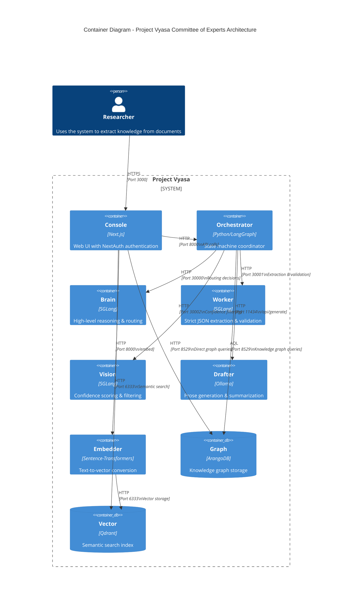

# System Map: Project Vyasa Architecture

> **C4 Container Diagram** showing the microservices architecture of the Fusion Stack.

## Overview

Project Vyasa follows a clean microservices architecture with functional naming. Each service has a single responsibility and communicates via well-defined APIs.

## Container Diagram



## Service Responsibilities

### Console (Next.js)

**Port**: 3000  
**Technology**: Next.js 14, NextAuth v5, TypeScript

**Responsibilities**:
- User authentication (NextAuth with password)
- Document upload and management
- Graph visualization
- API proxy for client-side requests

**Key Endpoints**:
- `/api/auth/*` - NextAuth authentication
- `/api/process-document` - Document processing
- `/api/graph-data` - Graph queries
- `/api/proxy/cortex` - Cortex API proxy

### Orchestrator (LangGraph)

**Port**: 8000  
**Internal DNS**: `orchestrator`  
**Technology**: Python, Flask, LangGraph, ArangoDB Client

**Responsibilities**:
- State machine coordination
- Asynchronous job management (max 2 concurrent jobs)
- Workflow routing decisions
- Memory query orchestration
- Content drafting coordination

**Key API Endpoints**:
- `GET /health` - Health check
- `POST /ingest/pdf` - PDF to Markdown conversion
- `POST /workflow/submit` - Submit async workflow job (returns `job_id`)
- `GET /workflow/status/<job_id>` - Get job status
- `POST /workflow/process` - Synchronous workflow (legacy)

**Key Components**:
- `Supervisor` - Main state machine node
- `SupervisorState` - TypedDict state definition
- `build_graph()` - LangGraph workflow construction
- `JobManager` - In-memory job registry (thread-safe)

### Brain (SGLang - Logic)

**Port**: 30000 (configurable via `${PORT_BRAIN}`)  
**Internal DNS**: `cortex-brain`  
**Technology**: SGLang, Large Model (e.g., `nvidia/nemotron-3-nano-30b`)  
**GPU**: `${BRAIN_GPU_IDS}` (Tensor Parallelism: 2)

**Responsibilities**:
- High-level reasoning and routing decisions
- JSON planning and structured output
- Supervisor workflow routing (QUERY_MEMORY, DRAFT_CONTENT, FINISH)

**Key Endpoints**:
- `/v1/chat/completions` - OpenAI-compatible API
- Supports `regex` parameter for structured output

### Worker (SGLang - Extraction)

**Port**: 30001 (configurable via `${PORT_WORKER}`)  
**Internal DNS**: `cortex-worker`  
**Technology**: SGLang, Cheap Model (e.g., `meta-llama/Llama-3.1-8B-Instruct`)  
**GPU**: `${WORKER_GPU_IDS}` (Tensor Parallelism: 1)

**Responsibilities**:
- Strict JSON extraction (PACT ontology)
- Graph validation (Critic role)
- High-volume extraction tasks

**Key Endpoints**:
- `/v1/chat/completions` - OpenAI-compatible API
- Used by Cartographer and Critic nodes

### Vision (SGLang - Eye)

**Port**: 30002 (configurable via `${PORT_VISION}`)  
**Internal DNS**: `cortex-vision`  
**Technology**: SGLang, Large Model (e.g., `nvidia/nemotron-3-nano-30b`)  
**GPU**: `${VISION_GPU_IDS}` (Tensor Parallelism: 2)

**Responsibilities**:
- Description and data point extraction
- Confidence scoring for triples
- Filters results where `confidence_score < 0.5`

**Key Endpoints**:
- `/v1/chat/completions` - OpenAI-compatible API
- Used by Vision node for confidence filtering

### Drafter (Ollama)

**Port**: 11434  
**Technology**: Ollama, Local LLM

**Responsibilities**:
- Prose generation
- Document summarization
- Creative content drafting

**Key Endpoints**:
- `/api/generate` - Text generation
- `/api/chat` - Chat completion

### Embedder (Sentence-Transformers)

**Port**: 8000  
**Technology**: Sentence-Transformers, FastAPI

**Responsibilities**:
- Convert text to embeddings
- Model: `all-MiniLM-L6-v2` (default)

**Key Endpoints**:
- `/embed` - Text-to-vector conversion
- `/health` - Health check

### Graph (ArangoDB)

**Port**: 8529  
**Technology**: ArangoDB

**Responsibilities**:
- Knowledge graph storage (nodes/edges)
- Role profile storage
- Document metadata
- AQL query execution

**Collections**:
- `entities` - Graph nodes
- `relations` - Graph edges
- `roles` - Dynamic role profiles
- `documents` - Document metadata

### Vector (Qdrant)

**Port**: 6333  
**Technology**: Qdrant

**Responsibilities**:
- Semantic search index
- Document embeddings storage
- Entity embeddings storage

**Collections**:
- `document-embeddings` - Document vectors
- `entity-embeddings` - Entity vectors

## Data Flow

### Document Processing Flow

```
User → Console → Orchestrator → Worker (extract) → Critic (validate) → Vision (filter) → Graph
                    ↓
                 ArangoDB (save)
```

1. User uploads document via Console
2. Console forwards to Orchestrator (async job submission)
3. Orchestrator routes to **Worker** (Cartographer node) for extraction
4. Worker returns structured JSON (PACT entities/relations)
5. Orchestrator routes to **Worker** (Critic node) for validation
6. If validation passes, Orchestrator routes to **Vision** for confidence filtering
7. Vision filters triples (confidence_score >= 0.5)
8. Orchestrator saves to ArangoDB (Saver node)
9. Console queries graph for visualization

### Semantic Search Flow

```
User → Console → Embedder → Vector (Qdrant)
                    ↓
              Search Results
```

1. User enters search query
2. Console sends text to Embedder
3. Embedder converts to vector
4. Console queries Qdrant for similar vectors
5. Results returned to user

### Role-Based Extraction Flow

```
Orchestrator → RoleRegistry → ArangoDB (roles collection)
                    ↓
              Dynamic System Prompt
                    ↓
              Worker/Vision/Brain (with prompt)
```

1. Orchestrator requests role from RoleRegistry
2. RoleRegistry queries ArangoDB for role profile
3. System prompt retrieved dynamically
4. Appropriate service (Worker/Vision/Brain) uses prompt:
   - **Cartographer** role → Worker service
   - **Critic** role → Worker service
   - **Vision** role → Vision service
   - **Supervisor** role → Brain service

## Network Architecture

All services run in a single Docker network (`${NETWORK_NAME}`, default: `vyasa-network`) and communicate via service names:

- `console` → `orchestrator` (Port 8000)
- `orchestrator` → `cortex-brain` (Port 30000)
- `orchestrator` → `cortex-worker` (Port 30001)
- `orchestrator` → `cortex-vision` (Port 30002)
- `orchestrator` → `drafter` (Port 11434)
- `console` → `embedder` (Port 80)
- `embedder` → `vector` (Port 6333)
- All services → `memory` (ArangoDB, Port 8529)
- All services → `vector` (Qdrant, Port 6333)

## Security

- **Console**: NextAuth password authentication
- **ArangoDB**: Root password required (`ARANGO_ROOT_PASSWORD`)
- **Qdrant**: API key authentication (`QDRANT_API_KEY`)
- **Internal Network**: Services communicate via Docker network (isolated)

## Scaling Considerations

- **Brain/Worker/Vision**: GPU-bound, single instance each (GPU reservations via `${BRAIN_GPU_IDS}`, `${WORKER_GPU_IDS}`, `${VISION_GPU_IDS}`)
- **Drafter**: GPU-bound, single instance (GPU reservation via `${DRAFTER_GPU_IDS}`)
- **Embedder**: CPU-bound, can scale horizontally
- **Graph**: Single instance (ArangoDB cluster for production)
- **Vector**: Single instance (Qdrant cluster for production)
- **Orchestrator**: CPU-bound, concurrency limited to 2 jobs (semaphore-controlled)
