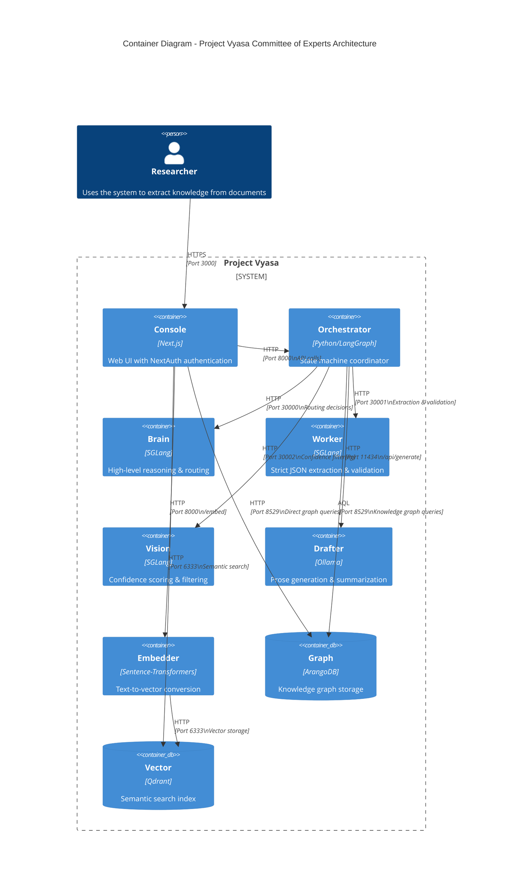

# System Map: Project Vyasa Architecture

> **C4 Container Diagram** showing the microservices architecture of the Fusion Stack.

## Overview

Project Vyasa follows a clean microservices architecture with functional naming. Each service has a single responsibility and communicates via well-defined APIs.

## Container Diagram



## Service Responsibilities

### Console (Next.js)

**Port**: 3000  
**Technology**: Next.js 14, NextAuth v5, TypeScript

**Responsibilities**:
- User authentication (NextAuth with password)
- Document upload and management
- Graph visualization
- API proxy for client-side requests

**Key Endpoints**:
- `/api/auth/*` - NextAuth authentication
- `/api/process-document` - Document processing
- `/api/graph-data` - Graph queries
- `/api/proxy/cortex` - Cortex API proxy

### Orchestrator (LangGraph)

**Port**: 8000  
**Internal DNS**: `orchestrator`  
**Technology**: Python, Flask, LangGraph, ArangoDB Client

**Responsibilities**:
- State machine coordination
- Asynchronous job management (max 2 concurrent jobs)
- Project context injection (early middleware pattern)
- Workflow routing decisions
- Graph query orchestration
- Content drafting coordination

**Key API Endpoints**:
- `GET /health` - Health check endpoint
  - Quick check (default): Returns 200 if server is up
  - Deep check (`?deep=true`): Pings ArangoDB and Cortex Worker to verify connectivity
  - Response includes `status`, `service`, `version`, and `dependencies` (when deep=true)
- `POST /api/projects` - Create project
- `GET /api/projects` - List projects
- `GET /api/projects/<project_id>` - Get project details
- `POST /ingest/pdf` - PDF to Markdown conversion (requires `project_id`)
- `POST /workflow/submit` - Submit async workflow job (returns `job_id`, accepts `project_id`)
- `GET /workflow/status/<job_id>` - Get job status
- `POST /workflow/process` - Synchronous workflow (legacy, accepts `project_id`)

**Key Components**:
- `ProjectService` - Project Kernel persistence layer
- `Supervisor` - Main state machine node
- `SupervisorState` - TypedDict state definition
- `build_graph()` - LangGraph workflow construction
- `JobManager` - In-memory job registry (thread-safe)

### Brain (SGLang - Reasoning)

**Port**: 30000 (configurable via `${PORT_BRAIN}`)  
**Internal DNS**: `cortex-brain`  
**Technology**: SGLang, `Llama-3.3-70B`  
**GPU**: `${BRAIN_GPU_IDS}` (Tensor Parallelism: 2)

**Responsibilities**:
- High-level reasoning and routing decisions
- JSON planning and structured output
- Supervisor workflow routing (QUERY_GRAPH, DRAFT_CONTENT, FINISH)

**Key Endpoints**:
- `/v1/chat/completions` - OpenAI-compatible API
- Supports `regex` parameter for structured output

### Worker (SGLang - Extraction)

**Port**: 30001 (configurable via `${PORT_WORKER}`)  
**Internal DNS**: `cortex-worker`  
**Technology**: SGLang, `Qwen 2.5 49B`  
**GPU**: `${WORKER_GPU_IDS}` (Tensor Parallelism: 1)

**Responsibilities**:
- Strict JSON extraction (knowledge graph)
- Graph validation (Critic role)
- High-volume extraction tasks
- Claim tagging (HIGH/LOW priority based on Project RQs)

**Key Endpoints**:
- `/v1/chat/completions` - OpenAI-compatible API
- Used by Cartographer and Critic nodes

### Vision (SGLang - Confidence Filtering)

**Port**: 30002 (configurable via `${PORT_VISION}`)  
**Internal DNS**: `cortex-vision`  
**Technology**: SGLang, `Qwen2-VL-72B`  
**GPU**: `${VISION_GPU_IDS}` (Tensor Parallelism: 2)

**Responsibilities**:
- Figure/table/chart interpretation
- Confidence scoring for triples
- Filters results where `confidence_score < 0.5`

**Key Endpoints**:
- `/v1/chat/completions` - OpenAI-compatible API
- Used by Vision node for confidence filtering

### Drafter (Ollama)

**Port**: 11434  
**Technology**: Ollama, Local LLM

**Responsibilities**:
- Prose generation
- Document summarization
- Creative content drafting

**Key Endpoints**:
- `/api/generate` - Text generation
- `/api/chat` - Chat completion

### Embedder (Sentence-Transformers)

**Port**: 8000  
**Technology**: Sentence-Transformers, FastAPI

**Responsibilities**:
- Convert text to embeddings
- Model: `all-MiniLM-L6-v2` (default)

**Key Endpoints**:
- `/embed` - Text-to-vector conversion
- `/health` - Health check

### Graph (ArangoDB)

**Port**: 8529  
**Technology**: ArangoDB

**Responsibilities**:
- Knowledge graph storage (nodes/edges)
- Project configuration storage (`ProjectConfig`)
- Role profile storage
- Document metadata
- Claim storage with priority tags
- AQL query execution

**Collections**:
- `projects` - Project configurations (Thesis, RQs, Anti-Scope)
- `entities` - Graph nodes
- `relations` - Graph edges
- `roles` - Dynamic role profiles
- `documents` - Document metadata
- `claims` - Extracted claims with priority tags (HIGH/LOW)

### Vector (Qdrant)

**Port**: 6333  
**Technology**: Qdrant

**Responsibilities**:
- Semantic search index
- Document embeddings storage
- Entity embeddings storage

**Collections**:
- `document-embeddings` - Document vectors
- `entity-embeddings` - Entity vectors

## Data Flow

### Document Processing Flow (Project-First)

```
User → Console → Orchestrator (with project_id) → Fetch ProjectConfig → Inject Context
                    ↓
                 Worker (extract + tag) → Critic (validate) → Vision (filter) → Graph
                    ↓
                 ArangoDB (save with project_id)
```

1. User uploads document via Console **with project_id** (required)
2. Console forwards to Orchestrator `/ingest/pdf` with `project_id` in FormData
3. Orchestrator middleware fetches `ProjectConfig` from ArangoDB
4. Project context (Thesis, RQs) is serialized and injected into workflow state
5. Orchestrator routes to **Worker** (Cartographer node) for extraction
   - Cartographer uses RQs to tag claims as HIGH/LOW priority
6. Worker returns structured JSON (knowledge graph entities/relations) with priority tags
7. Orchestrator routes to **Worker** (Critic node) for validation
8. If validation passes, Orchestrator routes to **Vision** for confidence filtering
9. Vision filters triples (confidence_score >= 0.5)
10. Orchestrator saves to ArangoDB (Saver node) with `project_id` linkage
11. Console queries graph for visualization (project-scoped)

### Semantic Search Flow

```
User → Console → Embedder → Vector (Qdrant)
                    ↓
              Search Results
```

1. User enters search query
2. Console sends text to Embedder
3. Embedder converts to vector
4. Console queries Qdrant for similar vectors
5. Results returned to user

### Role-Based Extraction Flow (with Project Context)

```
Orchestrator → RoleRegistry → ArangoDB (roles collection)
                    ↓
              Dynamic System Prompt
                    ↓
              Project Context (Thesis/RQs) Injection
                    ↓
              Worker/Vision/Brain (with prompt + context)
```

1. Orchestrator requests role from RoleRegistry
2. RoleRegistry queries ArangoDB for role profile
3. System prompt retrieved dynamically
4. Project context (Thesis, RQs) is injected into the prompt
5. Appropriate service (Worker/Vision/Brain) uses prompt + context:
   - **Cartographer** role → Worker service (tags claims HIGH/LOW based on RQs)
   - **Critic** role → Worker service (validates against Thesis)
   - **Vision** role → Vision service (confidence filtering)
   - **Supervisor** role → Brain service (routing decisions)

## Network Architecture

All services run in a single Docker network (`${NETWORK_NAME}`, default: `vyasa-network`) and communicate via service names:

- `console` → `orchestrator` (Port 8000)
- `orchestrator` → `cortex-brain` (Port 30000)
- `orchestrator` → `cortex-worker` (Port 30001)
- `orchestrator` → `cortex-vision` (Port 30002)
- `orchestrator` → `drafter` (Port 11434)
- `console` → `embedder` (Port 80)
- `embedder` → `vector` (Port 6333)
- All services → `graph` (ArangoDB, Port 8529)
- All services → `vector` (Qdrant, Port 6333)

## Security

- **Console**: NextAuth password authentication
- **ArangoDB**: Root password required (`ARANGO_ROOT_PASSWORD`)
- **Qdrant**: API key authentication (`QDRANT_API_KEY`)
- **Internal Network**: Services communicate via Docker network (isolated)

## Scaling Considerations

- **Brain/Worker/Vision**: GPU-bound, single instance each (GPU reservations via `${BRAIN_GPU_IDS}`, `${WORKER_GPU_IDS}`, `${VISION_GPU_IDS}`)
- **Drafter**: GPU-bound, single instance (GPU reservation via `${DRAFTER_GPU_IDS}`)
- **Embedder**: CPU-bound, can scale horizontally
- **Graph**: Single instance (ArangoDB cluster for production)
- **Vector**: Single instance (Qdrant cluster for production)
- **Orchestrator**: CPU-bound, concurrency limited to 2 jobs (semaphore-controlled)
